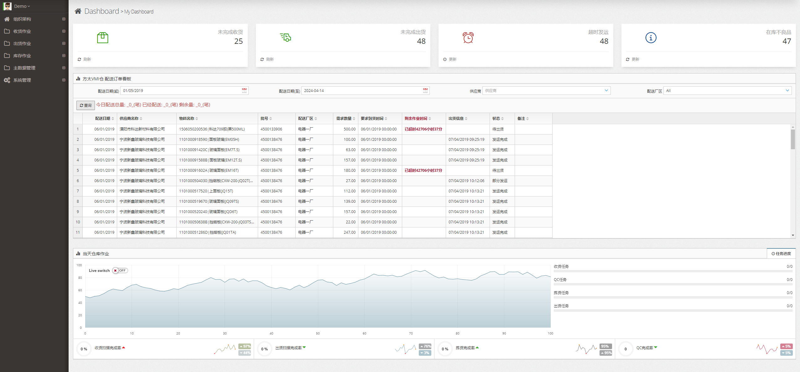
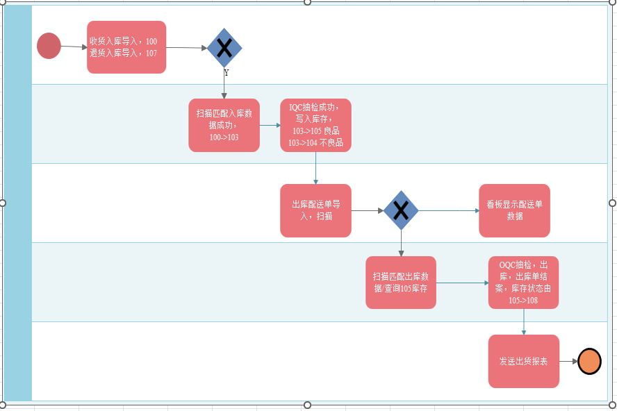
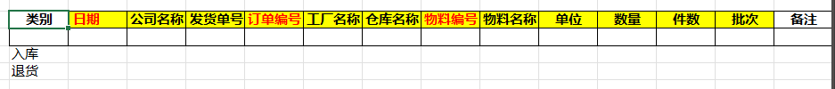
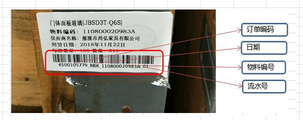
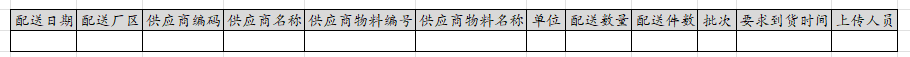

# wms质量管理系统

## 介绍
这是一个关于WMS（仓库管理系统）的项目，专注于货物入库和出库过程中的质量管理。该系统旨在通过精确跟踪和控制每一步操作，确保货物的完整性和合规性。项目功能包括自动化库存监控、数据分析以及异常处理，以提高仓库的运营效率和货物管理的精准度。此外，系统还支持生成详细的报告，帮助管理层做出更好的决策。

## 在线演示网站
- https://wmsqc.blazorserver.com/
- username: demo@email.com    
- password: 123456

## 需求
### 业务流程

### 入库扫码
1. 供应商提供到货数据包导入程式(通过EXCEL模板上传数据)；

2. Excel 模板为固定格式（业务人员提供）
3. 通过点击‘选择上传路径’控件，上传指定格式文件数据
4. 点击‘上传’控件，上传数据，插入到指定数据库中。(信息提示： Succeefully，数据上传成功，  false，数据上传失败 + ex.message)

5. 扫描信息，系统数据与实物外箱标签对比扫描
6. 该功能通过扫描枪功能实现
7. 业务人员选择日期,批号等条件，查询出对应的导入系统数据(数据来源为：供应商提供到货数据包导入程式 )
8. 扫描实物外箱标签，显示在‘外箱标签’栏位，比对该栏位是否存在查询的系统数据中，如果存在将其数据存储(备注状态103),如果不存在该信息不存在与系统中。

### IQC抽检
1. 系统103状态明细，待IQC确认检验合格，对应物料IQC可手动或批量选择点击入105
2. 系统103状态明细，待IQC确认检验不合格，对应物料IQC可手动或批量选择点击入104
3. 下拉框(combox)默认103 状态，点击查询 (系统中所有103 状态的数据)，如下格式显示记录
4. 抽检人员选择对应外箱标签进行抽检，可进行多选功能
5. 点击‘抽检合格’，将其选择的外箱标签状态从 103 修改为 105
6. 点击‘抽检不良’，将其选择的外箱标签状态从 103 修改为 104

### 出库扫码
1. 方太SRM系统订单出货信息导入到扫描程序

2. Excel 模板为固定格式（业务人员提供）
3. 通过点击‘选择上传路径’控件，上传指定格式文件数据
4. 点击‘上传’控件，上传数据，插入到指定数据库中。(信息提示： Succeefully，数据上传成功，  false，数据上传失败 + ex.message)
5. 实物与系统对比扫描

### 库存结余查询
1. 扫描信息状态至105，为仓库库存量；
2. 下拉框(combox)默认103，105，108 状态，点击查询 (系统中所有103，105，108  状态的数据)，如下格式显示记录
3. 点击‘生成EXCEL’,按照查询字段生成EXCEL 文件

### VMI 看板
